# GitHub Plus

[English](README.md) | 日本語

GitHub が少しだけ使いやすくなる Chrome 拡張です。
今のところ 10 と少しの機能を提供しています。

## インストール

* [Chrome ウェブストア](https://chrome.google.com/webstore/detail/github-plus/lndphafdikhmpgopmchckooegfnifafm)

## 機能

1. [リキッドデザイン](#liquid_design)
2. [空白の無視](#ignore_whitespaces)
3. [タブ幅の変更](#change_tab_size)
4. [コミットログの展開](#expand_commit_messages)
5. [省略記号 (…) の除去](#remove_ellipsis)
6. [ローカルタイム表示](#no_relative_time)
7. [全コメントの表示/非表示](#show_hide_all_comments)
8. [WIP のマージ禁止](#do_not_merge_wip)
9. [Close ボタンを左寄せ](#close_button_to_left)
10. [素早く引用](#quick_quoting)
11. [diff/patch ファイル](#diff_patch_file)

### 1. リキッドデザイン

#### Before

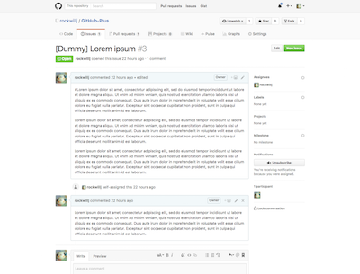

#### After

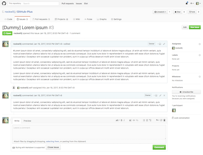

GitHub サイトにリキッドデザインを適用します。
ページコンテンツがウィンドウ幅まで広がります。

### 2. 空白の無視

#### Before

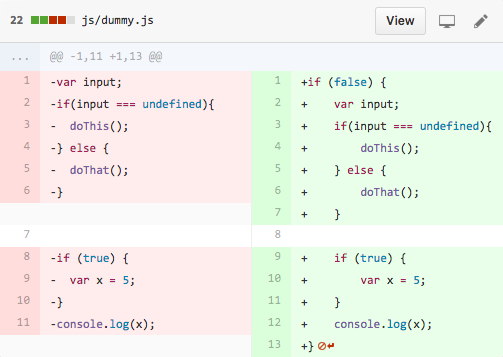

#### After

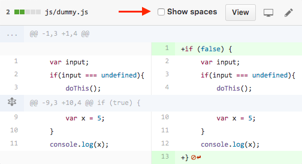

ファイル変更などで差分を見るときに空白を無視します。
`Show spaces` をチェックすると一時的に空白の差分が表示されます。

※ 注： GitHub の仕様により、空白を無視した状態だと

ボタンが表示されなくなり行にコメントが残せなくなるようです。
`Show spaces` をチェックしてこの機能を一時的に無効にするとボタンが表示されます。

### 3. タブ幅の変更

#### Before

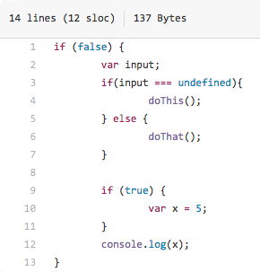

#### After

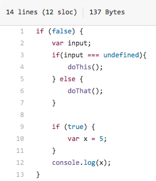

読みやすくするためソースコードのタブ幅をデフォルトの `8` から `4` に変更します。

### 4. コミットログの展開

#### Before

#### After

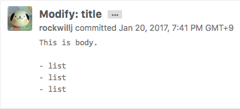

デフォルトで折り畳まれて表示されるコミットログを全て展開します。

### 5. 省略記号 (…) の除去

#### Before

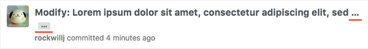

#### After

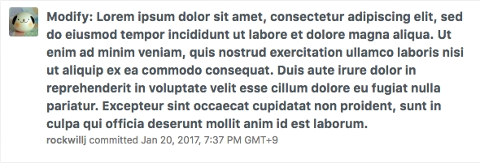

コミットログのタイトル (1行目) が長い場合に省略されないように、
省略記号 (`…`) を除去して分割されたタイトルを結合して表示します。

### 6. ローカルタイム表示

#### Before

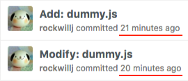

#### After

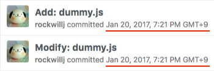

相対的なコミット日時 (例：`2 hours ago`, `5 days ago`) をローカルタイム (例：`Jan 17, 2017`) で表示します。
ローカルタイムの日時文字列をホバーすると相対的な日時がポップアップ表示されます。

### 7. 全コメントの表示/非表示

#### "Show all outdated" ボタン

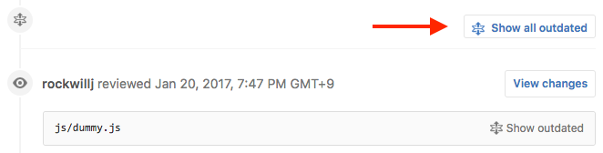

#### "Hide all outdated" ボタン

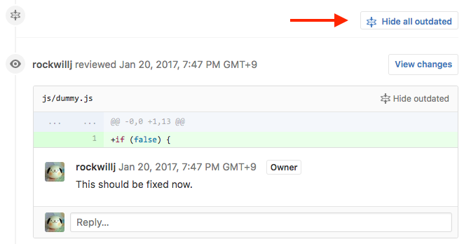

PR の全レビューコメントを一括で表示/非表示にするボタンがテキストボックス下に配置されます。

### 8. WIP のマージ禁止

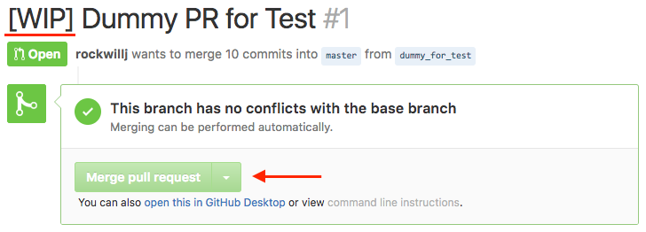

PR タイトルに以下のキーワードが含まれていると `Merge pull request` ボタンが無効になります。

* `WIP` (Work In Progress)
* `DNM` (Do Not Merge)

※ 大文字小文字は区別されるため `wip` や `dnm` はキーワード対象外です。

### 9. Close ボタンを左寄せ

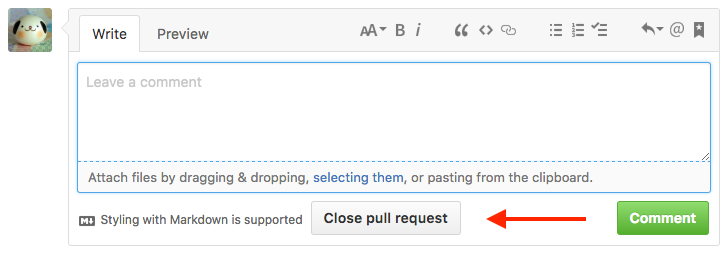

押し間違えを防ぐために PR / Issue ページ最下部の `Close` ボタンを左寄せにします。

### 10. 素早く引用

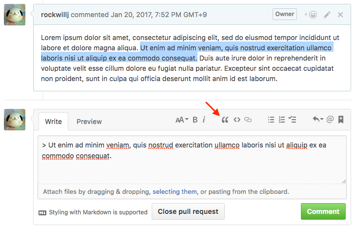

文字列を範囲選択して `Insert a quote` ボタンを押すと、
その文字列が引用された状態でテキストボックスに挿入されます。

※ 文字列を範囲選択して `r` (reply) キーを押したときと同じ挙動になります。

### 11. diff/patch ファイル

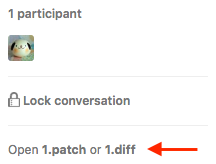

PR ページのサイドバーに PR の変更内容を `DIFF` / `PATCH` 形式で表示するリンクが追加されます。

## 既知の問題

- 「空白の無視」により diff に  ボタンが表示されなくなる (GitHub の仕様)
  - `Show spaces` をチェックしてこの機能を一時的に無効にするとボタンが表示される

## フィードバック

* [Issues](https://github.com/rockwillj/GitHub-Plus/issues) (日本語 OK)
* [Pull Requests](https://github.com/rockwillj/GitHub-Plus/pulls) (日本語 OK)

## Copyright & License

Copyright © 2017 Josuke Iwata (@rockwillj).

This software is released under the MIT License, see [LICENSE](LICENSE).
